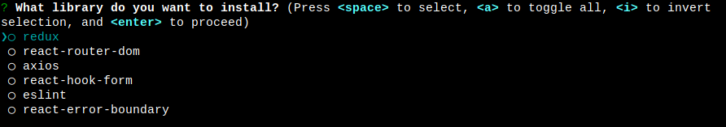

# create-framework-react

## You can use

 or

## Description
This is a the best framework react builder through webpack or vite builder

#### Node.js
Required 16.14.2 version or higher

#### Create framework react
`$ npx create-framework-react`

#### Usage
>First

`path/where/you/will/create/project>$ npx create-framework-react`
>Second

`Write the name of your project`

>Third

`Choose the builder of your project`

>Fourth

`Choose the port of your project`

>Fifth

`Choose what libraries you want install`

`The dependencies of your project will be installed`

`Finally`

### Contact me
gastonmgrecco@gmail.com